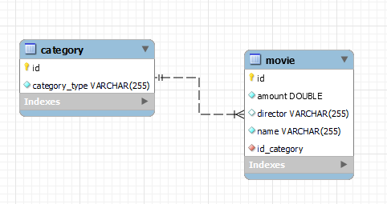
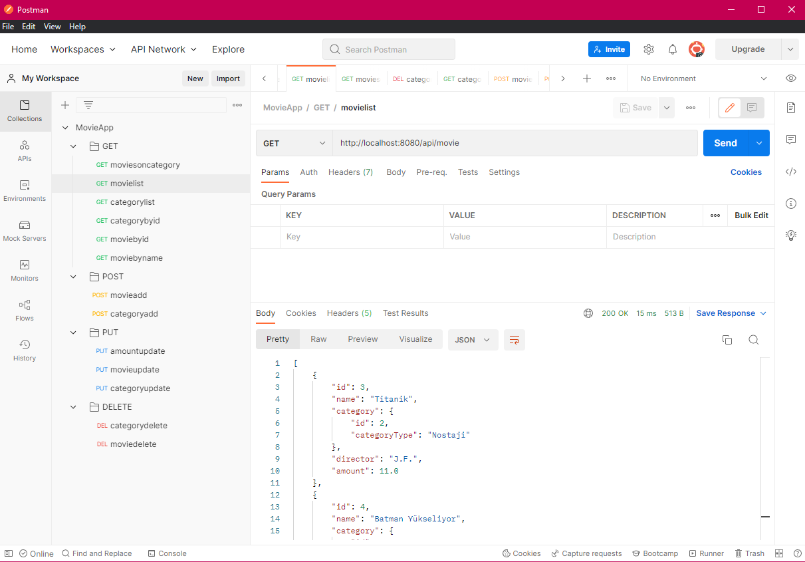
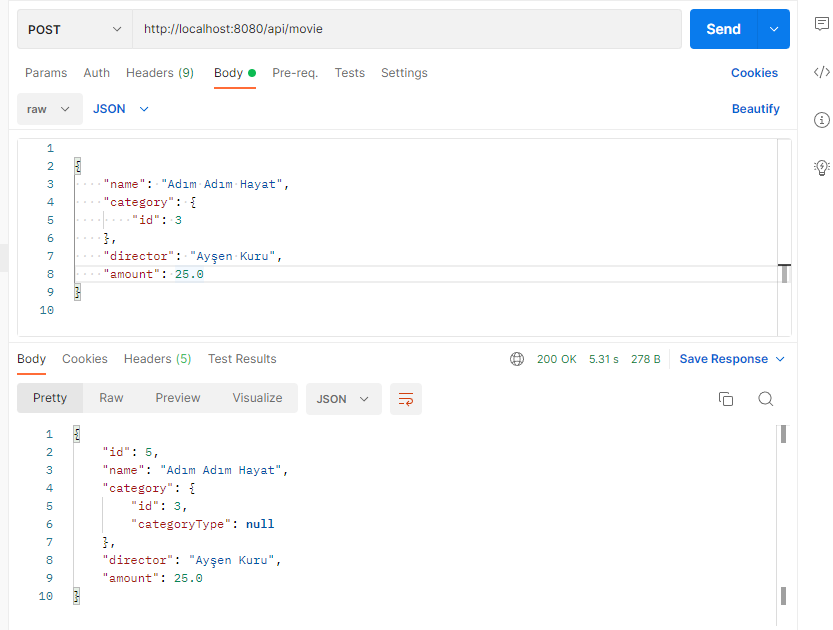
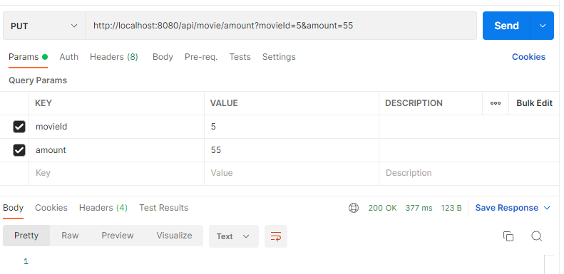

# MOVIE APP WITH SPRING BOOT
***ŞEYMA AYDIN***  

While developing this project, Spring Boot, Cache, Dockerize and MySQL technologies were used.

## Technologies & Tools

- Java 17
- Maven
- Spring Boot 2.7.0
- Cache
- Lombok
- MySql
- Redis
- JUnit

## API List

***Port : localhost:8080***

### MOVIE

- Movie List
    - /api/movie                : ***GET***
    
- Movie By ID
    - /api/movie/id/{id}        : ***GET***
    
- Movie By Name
    - /api/movie/name           : ***GET***
    
- Movie With CategoryId
    - /api/movie/categories     : ***GET***
    
- Add Movie
    - /api/movie                : ***POST***
    
- Update Movie
    - /api/movie                : ***PUT***
    
- Update Movie Amount
    - /api/movie/update         : ***PUT***
    
- Delete Movie
    - /api/movie                : ***DEL***
```
{
    "id": 4,
    "name": "Batman Yükseliyor",
    "category": {
        "id": 2,
        "categoryType": "Nostaji"
    },
    "director": "Johnson",
    "amount": 20.0
}        
```

### CATEGORY

- Category List
    - /api/category         : ***GET***
    
- Category By ID
    - /api/category         : ***GET***
    
- Add Category
    - /api/category         : ***POST*** 
    
- Update Category
    - /api/category         : ***PUT***
    
- Delete Category
    - /api/category         : ***DEL***
    
    
```
{
    "id": 10,
    "categoryType": "Eğlence"
}        
```
    
## PLANNING

- Cache memory is cleared by refreshing the project 5 times
- The category information is also displayed while the Movie List is displayed.
- When creating a movie recording, ID should be defined for category.
- When the category record is deleted, the movies belonging to the category are also deleted.
- If movies will be listed by category, category ID information must be entered.
- Category and movie information can only be taken with the id entry and can be found with the searched movie name.
- The movie can be updated by entering the ID of the movies and the price to be changed.
- Movie and categories can be updated in JSON format. If all information is entered, NULL value will not be returned.
- Movie recording can be deleted with ID. 


## DATABASE Entity Relation




## POSTMAN COLLECTION






